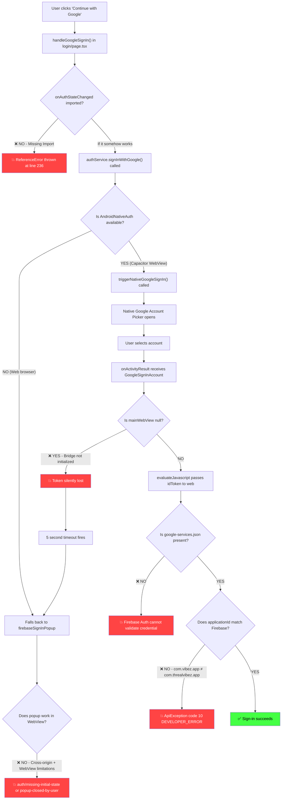

# 🔍 Google Login/Signup — Capacitor Android Diagnostic Report

> **Date**: August 8, 2026  
> **Status**: ❌ BROKEN — Multiple critical issues identified  
> **Severity**: Critical — Google Sign-In cannot work in current state

---

## Executive Summary

Google login/signup in the Capacitor Android app is failing because of **6 interconnected issues** spanning from missing configuration files, to package ID mismatches, to fundamental architectural conflicts, to code-level bugs. The app has **TWO competing Android architectures** in the same `android/` directory (a Capacitor WebView wrapper AND a native Jetpack Compose app) which create build and runtime conflicts. Additionally, the critical `google-services.json` file is completely missing, and the native Google Sign-In bridge has a faulty WebView reference pattern.

---

## Issue #1: Missing `google-services.json` (CRITICAL)

### The Problem
There is **no `google-services.json` file anywhere** in the project. This file is required by the `com.google.gms.google-services` Gradle plugin that is applied in [build.gradle.kts](file:///workspaces/threalvibez/android/app/build.gradle.kts#L4).

### Why This Breaks Google Sign-In
- `google-services.json` provides the OAuth 2.0 client IDs, Firebase project configuration, and the SHA-1 certificate fingerprint mapping for Android.
- Without it, the Google Services Gradle plugin will fail at build time, **or** if the APK was built without it, Firebase Auth SDK on the native side has no project binding and cannot authenticate.
- The native `GoogleSignInClient` in [MainActivity.java](file:///workspaces/threalvibez/android/app/src/main/java/com/threalvibez/app/MainActivity.java#L71-L81) calls `.requestIdToken(...)` but without `google-services.json`, the Google Sign-In API cannot validate the client identity.

### Files Involved
| File | Issue |
|------|-------|
| `android/app/google-services.json` | **MISSING** — does not exist |
| [android/app/build.gradle.kts](file:///workspaces/threalvibez/android/app/build.gradle.kts#L4) | References `google.services` plugin which requires the file |

### Fix Required
Download `google-services.json` from Firebase Console → Project Settings → Android app → and place it at `android/app/google-services.json`.

---

## Issue #2: Application ID Mismatch (CRITICAL)

### The Problem
There is a **three-way package/application ID mismatch**:

| Location | Value |
|----------|-------|
| [capacitor.config.json](file:///workspaces/threalvibez/capacitor.config.json#L2) → `appId` | `com.threalvibez.app` |
| [AndroidManifest.xml](file:///workspaces/threalvibez/android/app/src/main/AndroidManifest.xml#L3) → `package` | `com.threalvibez.app` |
| [build.gradle.kts](file:///workspaces/threalvibez/android/app/build.gradle.kts#L8-L12) → `namespace` + `applicationId` | `com.vibez.app` |
| [strings.xml](file:///workspaces/threalvibez/android/app/src/main/res/values/strings.xml#L5) → `package_name` | `com.threalvibez.app` |

### Why This Breaks Google Sign-In
- Google OAuth requires the `applicationId` in Gradle to match the package name registered in Firebase Console and Google Cloud Console.
- If Firebase Console has `com.threalvibez.app` but the built APK has `applicationId = "com.vibez.app"`, Google Sign-In will reject the app with a **status code 10 (DEVELOPER_ERROR)** — the most common cause of "loads but nothing happens".
- The SHA-1 certificate fingerprint is tied to a specific package name. A mismatch means the token request silently fails.

### Files Involved
| File | Line | Issue |
|------|------|-------|
| [build.gradle.kts](file:///workspaces/threalvibez/android/app/build.gradle.kts#L8) | L8 | `namespace = "com.vibez.app"` — should be `"com.threalvibez.app"` |
| [build.gradle.kts](file:///workspaces/threalvibez/android/app/build.gradle.kts#L12) | L12 | `applicationId = "com.vibez.app"` — should be `"com.threalvibez.app"` |

### Fix Required
Change `namespace` and `applicationId` in `android/app/build.gradle.kts` to `"com.threalvibez.app"` to match the Capacitor config and AndroidManifest.

---

## Issue #3: Two Competing `MainActivity` Classes (CRITICAL)

### The Problem
There are **TWO `MainActivity` files** with completely different architectures:

1. **Capacitor WebView-based** (the one actually used for Google auth):  
   [com/threalvibez/app/MainActivity.java](file:///workspaces/threalvibez/android/app/src/main/java/com/threalvibez/app/MainActivity.java)  
   → Extends `BridgeActivity` (Capacitor), loads web app in WebView, has native Google Sign-In bridge

2. **Native Jetpack Compose-based** (separate native app):  
   [com/vibez/app/MainActivity.kt](file:///workspaces/threalvibez/android/app/src/main/java/com/vibez/app/MainActivity.kt)  
   → Extends `ComponentActivity`, uses Compose UI, has its own `AuthViewModel`

### Why This Breaks Things
- The `build.gradle.kts` has `namespace = "com.vibez.app"`, which means the **Kotlin Compose MainActivity** is the one being launched, NOT the Capacitor `BridgeActivity`.
- The Kotlin MainActivity has **no Google Sign-In implementation** — it only has email/password auth via `AuthViewModel`.
- The Capacitor `MainActivity.java` (which has the Google Sign-In bridge code) is under package `com.threalvibez.app` but the build system's namespace is `com.vibez.app`, so it may not even be compiled or launched.

### Files Involved
| File | Architecture | Has Google Auth? |
|------|-------------|-----------------|
| [com/threalvibez/app/MainActivity.java](file:///workspaces/threalvibez/android/app/src/main/java/com/threalvibez/app/MainActivity.java) | Capacitor BridgeActivity + WebView | ✅ Yes — native GoogleSignIn bridge |
| [com/vibez/app/MainActivity.kt](file:///workspaces/threalvibez/android/app/src/main/java/com/vibez/app/MainActivity.kt) | Jetpack Compose ComponentActivity | ❌ No — only email auth |

### Fix Required
Decide on ONE architecture. If this is a Capacitor app, remove the `com/vibez/app/` Kotlin native code and align `applicationId`/`namespace` to `com.threalvibez.app`.

---

## Issue #4: Native Google Sign-In WebView Bridge Bug (HIGH)

### The Problem
In [MainActivity.java](file:///workspaces/threalvibez/android/app/src/main/java/com/threalvibez/app/MainActivity.java#L206-L219), the `setupWebView()` method gets the WebView reference from Capacitor's bridge:

```java
mainWebView = this.bridge.getWebView();   // Line 209
// ...
mainWebView.addJavascriptInterface(new NativeAuthInterface(), "AndroidNativeAuth");  // Line 219
```

**However**, `setupWebView()` is called in `onCreate()` at line 49, but at that point Capacitor's `bridge` may not be fully initialized yet (Capacitor initializes the bridge asynchronously after `super.onCreate()`). If `this.bridge` is `null`, the method silently catches the exception (line 320-322) and `mainWebView` remains `null`.

### Consequence
When the web app calls `AndroidNativeAuth.triggerNativeGoogleSignIn()`, the native code correctly starts the Google Sign-In intent. But when the result comes back in `onActivityResult()` (line 122-158), it tries to call `mainWebView.evaluateJavascript(...)` to pass the token back. If `mainWebView` is null, the token is **silently lost** — the web app never receives the Google ID token.

This matches the reported behavior: *"the OAuth page comes up, you select an account, but then it just keeps loading"*.

### The Auth Service Timeout Confirms This
In [auth-service.ts](file:///workspaces/threalvibez/src/lib/auth-service.ts#L310-L314), there's a 5-second timeout:

```typescript
timeoutId = setTimeout(() => {
  console.warn('[Auth Service] Native Google Auth timed out, proceeding with Web Auth...');
  resolve(null);
}, 5000);
```

When the native bridge fails to return the token, the code times out after 5 seconds and falls back to `firebaseSignInPopup()`. But popup-based auth in a WebView also has issues (see Issue #5).

### Files Involved
| File | Lines | Issue |
|------|-------|-------|
| [MainActivity.java](file:///workspaces/threalvibez/android/app/src/main/java/com/threalvibez/app/MainActivity.java#L44-L51) | L44-51 | `setupWebView()` called before bridge may be ready |
| [MainActivity.java](file:///workspaces/threalvibez/android/app/src/main/java/com/threalvibez/app/MainActivity.java#L129-L136) | L129-136 | Token injection via `evaluateJavascript` fails silently if `mainWebView` is null |
| [auth-service.ts](file:///workspaces/threalvibez/src/lib/auth-service.ts#L285-L327) | L285-327 | Native bridge with 5s timeout fallback |

### Fix Required
Move `setupWebView()` call to after the bridge is initialized (override `onBridgeReady()` or use a delayed init), and add null checks + error reporting before calling `mainWebView.evaluateJavascript()`.

---

## Issue #5: `firebaseSignInPopup()` Cannot Work in Android WebView (HIGH)

### The Problem
When the native Google Sign-In bridge fails (Issue #4), the code falls back to Firebase's popup-based sign-in:

```typescript
// auth-service.ts line 342
const popupPromise = firebaseSignInPopup(auth, provider);
```

### Why This Fails in Capacitor Android
- `signInWithPopup()` opens a new browser window/popup for Google OAuth.
- In Android WebView (which is what Capacitor uses), popups are handled via `onCreateWindow()` in the WebChromeClient (line 247-317 of `MainActivity.java`).
- The popup WebView creates a dialog, but the OAuth callback URL `/__/auth/handler` tries to communicate back to the **parent WebView via `window.opener`** — which is a different WebView instance in this implementation.
- Cross-WebView `window.opener` communication does not work reliably in Android WebViews.
- The session storage bridge code at lines 270-294 of `MainActivity.java` attempts to copy `sessionStorage` from parent to popup, but this is insufficient for Firebase Auth's popup flow because Firebase Auth requires `postMessage` communication between the popup and opener, which doesn't work across separate WebView instances.

### The Auth Domain Configuration Compounds This
In [firebase-init.ts](file:///workspaces/threalvibez/src/lib/firebase-init.ts#L53-L56):

```typescript
const isVercel = !!process.env.NEXT_PUBLIC_VERCEL_URL || !!process.env.VERCEL;
const authDomainResolved = isVercel
  ? 'threalvibez.vercel.app'
  : (process.env.NEXT_PUBLIC_FIREBASE_AUTH_DOMAIN || 'blackvienna-ea6c7.firebaseapp.com');
```

On a Capacitor Android app, neither `NEXT_PUBLIC_VERCEL_URL` nor `VERCEL` env vars exist, so the auth domain defaults to `blackvienna-ea6c7.firebaseapp.com`. The popup OAuth redirect goes to this domain, which is a **different origin** from `threalvibez.vercel.app` (the server URL configured in Capacitor). This cross-origin mismatch causes the `auth/missing-initial-state` error.

### Files Involved
| File | Lines | Issue |
|------|-------|-------|
| [auth-service.ts](file:///workspaces/threalvibez/src/lib/auth-service.ts#L340-L397) | L340-397 | Popup auth + redirect fallback — both fail in WebView |
| [firebase-init.ts](file:///workspaces/threalvibez/src/lib/firebase-init.ts#L53-L56) | L53-56 | Auth domain mismatch for Android |
| [MainActivity.java](file:///workspaces/threalvibez/android/app/src/main/java/com/threalvibez/app/MainActivity.java#L247-L317) | L247-317 | Popup WebView dialog implementation |
| [capacitor.config.json](file:///workspaces/threalvibez/capacitor.config.json#L7) | L7 | Server URL points to Vercel |

### Fix Required
Don't rely on popup/redirect auth in Android WebView at all. The native Google Sign-In bridge (Issue #4 fix) should be the ONLY path for Android. Ensure the native bridge works reliably and remove fallback to popup/redirect on Android.

---

## Issue #6: Missing `onAuthStateChanged` Import in Login Page (MEDIUM)

### The Problem
In [login/page.tsx](file:///workspaces/threalvibez/src/app/(auth)/login/page.tsx#L236), `onAuthStateChanged` is called:

```typescript
const unsubscribe = onAuthStateChanged(auth, (u) => {  // Line 236
```

But checking the import statements (lines 1-33), `onAuthStateChanged` is **NOT imported** from `firebase/auth`. The import on line 12 only imports:

```typescript
import { sendPasswordResetEmail, browserLocalPersistence, browserSessionPersistence, setPersistence } from 'firebase/auth';
```

### Why This Could Cause Issues
- If `onAuthStateChanged` is available as a global or from another module, it may work by accident.
- If it fails at runtime, the entire `handleGoogleSignIn` function throws an error on line 236, **before** even calling `authService.signInWithGoogle()`. This would cause the button to show "Signing in..." briefly and then show an error toast, which matches reported symptoms.

### Files Involved
| File | Line | Issue |
|------|------|-------|
| [login/page.tsx](file:///workspaces/threalvibez/src/app/(auth)/login/page.tsx#L12) | L12 | Missing `onAuthStateChanged` in import |
| [login/page.tsx](file:///workspaces/threalvibez/src/app/(auth)/login/page.tsx#L236) | L236 | Uses `onAuthStateChanged` without importing it |

### Fix Required
Add `onAuthStateChanged` to the import on line 12:
```typescript
import { sendPasswordResetEmail, browserLocalPersistence, browserSessionPersistence, setPersistence, onAuthStateChanged } from 'firebase/auth';
```

---

## Issue #7: No SHA-1 Signing Configuration (HIGH)

### The Problem
The [build.gradle.kts](file:///workspaces/threalvibez/android/app/build.gradle.kts) has **no `signingConfigs`** block. Without specifying the debug/release keystore SHA-1 fingerprint:

- Google OAuth requires the SHA-1 fingerprint of the signing certificate to be registered in Firebase Console (under Project Settings → Android app).
- If the APK is signed with a debug keystore whose SHA-1 is not registered in Firebase/Google Cloud Console, Google Sign-In will fail with **ApiException status code 10 (DEVELOPER_ERROR)**.

### Files Involved
| File | Issue |
|------|-------|
| [build.gradle.kts](file:///workspaces/threalvibez/android/app/build.gradle.kts) | No `signingConfigs` block |
| Firebase Console | SHA-1 fingerprint may not be registered |

### Fix Required
1. Get the debug keystore SHA-1: `keytool -list -v -keystore ~/.android/debug.keystore -alias androiddebugkey -storepass android`
2. Add this SHA-1 fingerprint in Firebase Console → Project Settings → Android app → SHA certificate fingerprints
3. Re-download `google-services.json` after adding the fingerprint

---

## Issue #8: Hardcoded Google Web Client ID (MEDIUM)

### The Problem
In [MainActivity.java](file:///workspaces/threalvibez/android/app/src/main/java/com/threalvibez/app/MainActivity.java#L74), the Google Web Client ID is hardcoded:

```java
.requestIdToken("1003230563610-hilqtdtlqpujrkp3j0oc61tg0aq86mmn.apps.googleusercontent.com")
```

### Potential Issue
- This must be the **Web Client ID** from Google Cloud Console (NOT the Android Client ID).
- If this client ID doesn't match what's configured in Firebase Console for this project, the ID token will be invalid and `firebaseSignInCredential(auth, credential)` will fail.
- Additionally, this client ID should be stored in `strings.xml` or read from `google-services.json`, not hardcoded.

### Files Involved
| File | Line | Issue |
|------|------|-------|
| [MainActivity.java](file:///workspaces/threalvibez/android/app/src/main/java/com/threalvibez/app/MainActivity.java#L74) | L74 | Hardcoded web client ID |

---

## Complete Flow: What Happens When User Clicks "Continue with Google"



---

## Summary of All Issues and Required Fixes

| # | Issue | Severity | File(s) | Fix |
|---|-------|----------|---------|-----|
| 1 | **Missing `google-services.json`** | 🔴 Critical | `android/app/` | Download from Firebase Console and place in `android/app/` |
| 2 | **Application ID mismatch** (`com.vibez.app` vs `com.threalvibez.app`) | 🔴 Critical | [build.gradle.kts](file:///workspaces/threalvibez/android/app/build.gradle.kts#L8-L12) | Change `namespace` and `applicationId` to `com.threalvibez.app` |
| 3 | **Two competing `MainActivity` classes** (Capacitor vs Compose) | 🔴 Critical | [MainActivity.java](file:///workspaces/threalvibez/android/app/src/main/java/com/threalvibez/app/MainActivity.java), [MainActivity.kt](file:///workspaces/threalvibez/android/app/src/main/java/com/vibez/app/MainActivity.kt) | Remove the Kotlin/Compose native app or restructure to single architecture |
| 4 | **WebView bridge race condition** — `mainWebView` may be null when token returns | 🟠 High | [MainActivity.java](file:///workspaces/threalvibez/android/app/src/main/java/com/threalvibez/app/MainActivity.java#L206-L219) | Initialize WebView after bridge is ready; add null-safety |
| 5 | **`signInWithPopup` doesn't work in Android WebView** — cross-origin and WebView limitations | 🟠 High | [auth-service.ts](file:///workspaces/threalvibez/src/lib/auth-service.ts#L340-L397), [firebase-init.ts](file:///workspaces/threalvibez/src/lib/firebase-init.ts#L53-L56) | Use ONLY native Google Sign-In on Android; skip popup/redirect fallback |
| 6 | **Missing `onAuthStateChanged` import** in login page | 🟡 Medium | [login/page.tsx](file:///workspaces/threalvibez/src/app/(auth)/login/page.tsx#L12) | Add `onAuthStateChanged` to the firebase/auth import |
| 7 | **No SHA-1 signing configuration** | 🟠 High | [build.gradle.kts](file:///workspaces/threalvibez/android/app/build.gradle.kts) + Firebase Console | Register debug/release SHA-1 fingerprints in Firebase Console |
| 8 | **Hardcoded Web Client ID** | 🟡 Medium | [MainActivity.java](file:///workspaces/threalvibez/android/app/src/main/java/com/threalvibez/app/MainActivity.java#L74) | Verify the client ID matches Firebase project; move to `strings.xml` |

---

## Root Cause Analysis

The **primary root cause** is that the `android/` directory appears to be a hybrid of two different projects:

1. A **Capacitor WebView wrapper** (the `com.threalvibez.app.MainActivity` Java class extending `BridgeActivity`)
2. A **native Jetpack Compose app** (the entire `com.vibez.app` Kotlin package with ViewModels, Compose screens, navigation, etc.)

The Gradle build is configured for the native Compose app (`com.vibez.app`), not the Capacitor wrapper (`com.threalvibez.app`). This means:
- The wrong `MainActivity` is being launched
- The application ID doesn't match Firebase configuration
- The native Google Sign-In bridge code may not even be compiled into the APK
- Even if it were, the missing `google-services.json` and SHA-1 configuration would prevent it from working

> [!CAUTION]
> **DO NOT just fix one issue** — all 8 issues need to be addressed together. Fixing just the `google-services.json` without fixing the application ID mismatch will still result in DEVELOPER_ERROR. Fixing both without resolving the dual-MainActivity conflict means the wrong activity launches.

---

## Recommended Fix Order

1. ⬜ Decide architecture: Capacitor WebView OR native Compose (remove the other)
2. ⬜ Align `applicationId`/`namespace` in `build.gradle.kts` to `com.threalvibez.app`
3. ⬜ Add `google-services.json` from Firebase Console
4. ⬜ Register SHA-1 fingerprints in Firebase Console
5. ⬜ Fix the WebView bridge initialization timing in `MainActivity.java`
6. ⬜ Add missing `onAuthStateChanged` import in login page
7. ⬜ Skip popup/redirect auth fallback when running on Android Capacitor
8. ⬜ Move hardcoded client ID to `strings.xml` or `google-services.json`
